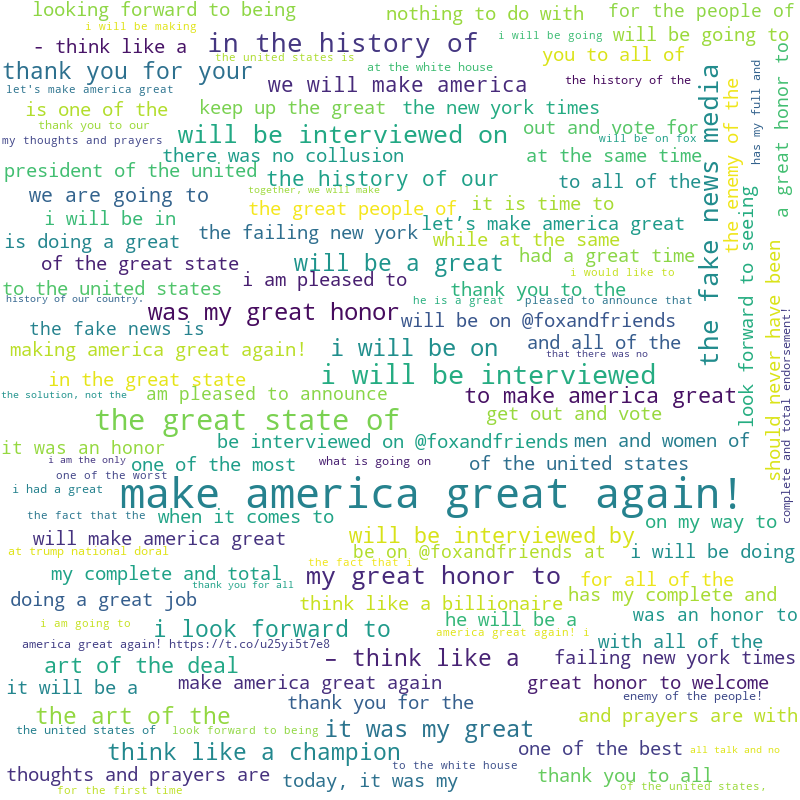

<md-cover title='Trump Tweet Sentiment Analysis' author='Luke Ireland'></md-cover>
<md-style name="latex"></md-style>

# Table of Contents <!-- omit in toc -->

- [1. Introduction](#1-introduction)
  - [1.1. Background](#11-background)
  - [1.2. Aim](#12-aim)
  - [1.3. Objectives](#13-objectives)
- [2. Literature Review](#2-literature-review)
- [3. Parsing](#3-parsing)
- [4. Tweet Cleaner](#4-tweet-cleaner)
- [5. Sentiment Scoring](#5-sentiment-scoring)
- [6. Sentiment Classification](#6-sentiment-classification)
- [7. Word Cloud](#7-word-cloud)
- [8. Frequency Distribution](#8-frequency-distribution)
- [9. Tweet Generator](#9-tweet-generator)
- [10. Web Application Presentation](#10-web-application-presentation)
- [11. Evaluation](#11-evaluation)
- [12. Conclusion](#12-conclusion)
- [13. References](#13-references)

# 1. Introduction

This project focuses on comparison of Sentiment Analysis algorithms and various other forms of Natural Language Processing(NLP), with a chosen dataset of Donald Trump's tweets.

Sentiment Analysis is classifying text into various classifications. In this case, it is into 3 classes: negative, neutral and positive. Natural Language Processing is the subfield of linguistics and computer science that looks at how computers process and analyze speech and text. Sentiment Analysis is a form of NLP.

Analysis methods include:

- Frequency Distribution
- Word Clouds
- Sentiment Analysis
- Tweet Generation

Frequency Distribution is another form of NLP that looks at the frequency of words and phrases within a given corpus. It is useful to be able to remove stopwords (words that don't have any sentiment) from a corpus, and to highlight which words are more important in deciding the general sentiment of a given corpus, or the specific sentiment of a given sentence or paragraph.

Word Clouds provide visual representations of the frequency of words and phrases within a given corpus.

Tweet Generation typically involves using Markov chains, to replicate the prose within a corpora, and use that understanding to generate tweets that have the same prose as the original corpora.

Markov chains are models that describe the sequence of possible events, and their possibilities are dependent on the state set in the previous event.

The output from these analysis methods will be presented as a web page via Flask, which is a web framework for Python, and PonyORM, which is a object relational manager for Python.

## 1.1. Background

I was interested analyzing Trump's tweets for sentiment due to his controversial nature. It would be interesting to see, given what the media often say about him, if he truly is a bad (negative) person via unbiased (relative to humans, who are emotional and often irrational) sentiment analysis, and letting a machine look just at the words used, rather than the character of the person saying them.

I had also imagined it would be entertaining to analyse his tweets in other was, such as word clouds, frequency distribution and tweet generation, to see if he is overly repetitive of words or phrases, such as "MAGA" or "Make America Great Again", and to see if I could make tweets that are very similar to his style, in order to see if it's possible to capture (part of) his cognitive function in a Python function.

While looking at the various algorithms available to perform this sort of task, I thought it would be worthwhile to evaluate which of them works best on tweets, which are typically informal, 280 character long posts submitted to Twitter.

## 1.2. Aim

The aim of this project is to perform various types of analysis on the language used in Trump's tweet to see if any interesting trends arise. Mainly, this project seeks to inform and entertain people interested in Trump, for either good or bad reasons.

I will also be evaluating the performance of sentiment analysis algorithms on their speed and accuracy.

## 1.3. Objectives

1. Perform frequency distribution on variable length phrases.
2. Render word clouds of phrases.
3. Analyse whole tweets for sentiment.
4. Create unbiased classifer to initally label dataset
5. Find sentiment classifer algorithms
6. Compare classification algorithms to see which is the most accurate and the fastest.
7. Create tweets using data from Trump's Twitter account.

# 2. Literature Review

I decided to use Python as it's my strongest language, plus it's flexibility across platforms and level of API support makes it an obvious choice.

I originally planned to use Twitter's API via [Twitter Search](https://github.com/ckoepp/TwitterSearch)[^1], but I couldn't use it due to being unable to apply for a Twitter Developer Account.
I instead opted for someone else's collected tweets at [Trump Twitter Archive](http://www.trumptwitterarchive.com/archive)[^2]. The export format wasn't great, as you had to wait a while for the page to compile all the tweets into the correct format (When it would be useful to have it precompiled) and the page doesn't actually give you a JSON file, just a text output in JSON format, that you have to slowly copy and paste into a file and use programs to format the JSON into readable format.

I saw guides such as [Basic Binary Sentiment Analysis using NLTK](https://towardsdatascience.com/basic-binary-sentiment-analysis-using-nltk-c94ba17ae386)[^3], [Text Classification using NLTK](https://pythonprogramming.net/text-classification-nltk-tutorial/)[^4] and [Creating a Twitter Sentiment Analysis program using NLTK's Naive Bayes Classifier](https://towardsdatascience.com/creating-the-twitter-sentiment-analysis-program-in-python-with-naive-bayes-classification-672e5589a7ed)[^5] using NLTK's Naive Bayes Classifier, but they used pre-processed data meaning I can't use them for my tweets, as that would mean using an classifier trained on film reviews, on tweets, specifically do. This [guide](https://www.freecodecamp.org/news/how-to-make-your-own-sentiment-analyzer-using-python-and-googles-natural-language-api-9e91e1c493e/)[^6] used Google's Natural Language API to perform Sentiment Analysis, but this method required constant communication with Google's Cloud server, so was fairly slow overall.

Eventually, I fell upon this [article](https://www.geeksforgeeks.org/twitter-sentiment-analysis-using-python/)[^7] which used TextBlob to perform sentiment analysis instead.
TextBlob is a simplified text processing library for Python, and provides a simple API for performing Natural Language Processing tasks, such as speech tagging, noun extraction, classification, translation and, most importantly, sentiment analysis.

I needed more methods of sentiment analysis, so I decided on using [Latent Sentiment Analysis(LSA)](https://medium.com/@adi_enasoaie/easy-lsi-pipeline-using-scikit-learn-a073f2484408), Random Forests (used as both part of LSA, and independently), [XGBoost](https://www.datacamp.com/community/tutorials/xgboost-in-python)[^9], Logistic Regression and Multilayer Perceptron models to compare to my Naive Bayes classifier.

Latent Sentiment Analysis(LSA) is one SA (Sentiment Analysis) technique that scores a corpus based on an assumption meaning similar meaning words will appear in similar pieces of text.

Naive Bayes classifiers are simple probabilistic classifers which applies Bayes' theorem of naive assumptions between the features. I will be using a Multinomial Naive Bayes classifier, which uses feature vectors in the form of histograms, which count the number of times an event (in this case - sentiment) was observed in a particular instance (in this case - document).

Random Forest classifiers operate by constructing multiple decision trees at training time, and uses the mode of each individual tree's classification of the input vector to decide upon a class.

XGBoost classifier is a gradient boosting algorithm that uses proportional shrinking of leaf nodes, smart tree penalization and differentiation to improve it's understanding of each of the classes used in training. It uses a variety of parameters requiring optimisation to improve accuracy. Gradient boosting algorithms produce prediction models in the form of an ensemble weak prediction model, typically decision trees (similar to random forest). The models are then built in stages, and generalised by allowing optimisation of an abitrary differentiable loss function, often softmax for multiclass classifiers.

A Multilayer Perceptron is a type of feedforward artificial neural network, consisting of an input layer, a hidden layer and an output layer. Each non-input node is a neuron that uses a nonlinear activation function, and uses a supervised learning technique called backpropagation, similar to the least mean squares algorithm, for training. Learning is performed by changing the connection weights between the layers, based on the amount of error between the prediction and actual class.

Logisitic Regression is a classifier model that uses a logistic function to model a dependent variable. It measures the relationship between the categorical dependent variable and one or more independent variables by estamating probabilities using a logistic function, which is the cumulative distribution function of logistic regression. 

I will specifically be using multinomial logistic regression, as I have 3 classes. The score vector for a given document (tweet) is in the format: scores(X,k) = βk*X, where X is a vector of the words that make up the tweet, and β is a vector of weights corresponding to outcome (class) k. This score vector is then used by the softmax function to calculate a probability of the tweet belonging to that sentiment.

Softmax is simply: escores/sum(scores), where scores a vector where each element corresponds to a word and sentiment prediction.

Due to their simple effectiveness, I assume Naive Bayes, Random Forest, and Logistic Regression will perform the best to begin with, certainly in terms of speed, but with tweaking, Multilayer Perceptron and XGB should provide comparable or better accuracy.

After coming across this article on [algorithm comparison](https://medium.com/towards-artificial-intelligence/text-classification-by-xgboost-others-a-case-study-using-bbc-news-articles-5d88e94a9f8)[^10], I found that creating a tf-idf transformer to use on the initial bag of words model massively boosts accuracy.

When implementing my models, I discovered that the fairest, most reproducible method of comparison was using Scikit Learn's [Pipelines](https://medium.com/towards-artificial-intelligence/text-classification-by-xgboost-others-a-case-study-using-bbc-news-articles-5d88e94a9f8)[^10], and began altering my code to minimise the difference between how classifiers are ran, to isolate the performance of the classifier down to the algorithm itself and not any pre-processing. I had to cut Latent Sentiment Analysis as it didn't fit this streamlined format, due to the way it retrospectively trains itself.

For tweet generation, I used [Markovify](https://github.com/jsvine/markovify)[^11], which I found from [this](https://medium.com/@mc7968/whatwouldtrumptweet-topic-clustering-and-tweet-generation-from-donald-trumps-tweets-b191fccaffb2)[^12] article attempting the same thing. The article listed multiple approaches, including using a Keras API and k-means clustering to build a Machine Learning model to feed into tweet generators, but that added a significant layer of obscurity to getting truly random tweets each time random tweets are requested. For example, it made it possible to get tweets about Hillary Clinton and North Korea in the same tweet/sentence.

# 3. Parsing

I used Python's JSON library to load the .json file into the program as a dict.

# 4. Tweet Cleaner

I removed non-alphabetical characters from the tweet.

# 5. Sentiment Scoring

I used TextBlob to retrieve a sentiment score

# 6. Sentiment Classification

I decided to choose rather narrow ranges for each sentiment class.

- Less than -0.25 = Negative
- Between +0.25 and -0.25 = Neutral
- More than +0.25 = Positive

# 7. Word Cloud

Here is a word cloud I created using the Python library wordcloud.
_Figure 1_ - WordCloud of phrases of length 4.

# 8. Frequency Distribution

I used NLTK to look at the most common words and phrases of different lengths.

# 9. Tweet Generator

I created my own class using Markovify[^8], that would force the generator to generate tweets containing a given user word.

# 10. Web Application Presentation

I used PonyORM to...

# 11. Evaluation

Results and findings

# 12. Conclusion

# 13. References

[^1]: https://github.com/ckoepp/TwitterSearch
[^2]: http://www.trumptwitterarchive.com/archive
[^3]: https://towardsdatascience.com/basic-binary-sentiment-analysis-using-nltk-c94ba17ae386
[^4]: https://pythonprogramming.net/text-classification-nltk-tutorial/
[^5]: https://towardsdatascience.com/creating-the-twitter-sentiment-analysis-program-in-python-with-naive-bayes-classification-672e5589a7ed
[^6]: https://www.freecodecamp.org/news/how-to-make-your-own-sentiment-analyzer-using-python-and-googles-natural-language-api-9e91e1c493e/
[^7]: https://www.geeksforgeeks.org/twitter-sentiment-analysis-using-python/
[^8]: https://github.com/jsvine/markovify
[^9]: https://medium.com/@mc7968/whatwouldtrumptweet-topic-clustering-and-tweet-generation-from-donald-trumps-tweets-b191fccaffb2
