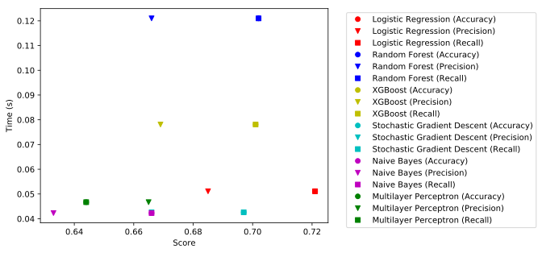
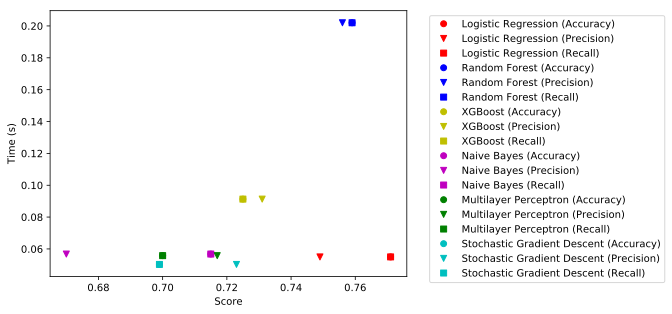
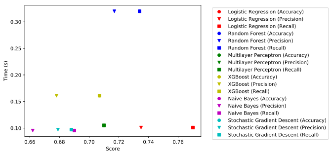
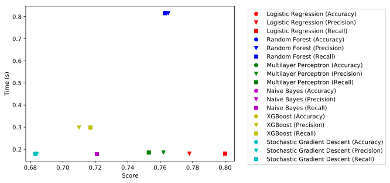

<md-cover title='Trump Tweet Sentiment Analysis' author='Luke Ireland'></md-cover>
<md-style name="latex"></md-style>

WC: 2600

# Table of Contents <!-- omit in toc -->

- [1. Introduction](#1-introduction)
  - [1.1. Background](#11-background)
  - [1.2. Aim](#12-aim)
  - [1.3. Objectives](#13-objectives)
- [2. Literature Review](#2-literature-review)
- [3. Data Pre-processing](#3-data-pre-processing)
  - [3.1 Dataset](#31-dataset)
  - [3.2 Labelling](#32-labelling)
- [4. How I compared each Sentiment Classification algorithm to one another](#4-how-i-compared-each-sentiment-classification-algorithm-to-one-another)
- [5. Evaluation](#5-evaluation)
  - [Results](#results)
    - [Aggregated Statistics](#aggregated-statistics)
    - [By Accuracy (All Tweets)](#by-accuracy-all-tweets)
    - [By Precision (All Tweets)](#by-precision-all-tweets)
    - [By Time (All Tweets)](#by-time-all-tweets)
  - [Findings](#findings)
    - [5776 Tweets (1/8 of total)](#5776-tweets-18-of-total)
    - [11552 Tweets (1/4 of total)](#11552-tweets-14-of-total)
    - [17328 Tweets (3/8 of total)](#17328-tweets-38-of-total)
    - [23104 Tweets (1/2 of total)](#23104-tweets-12-of-total)
    - [28880 Tweets (5/8 of total)](#28880-tweets-58-of-total)
    - [34656 Tweets (3/4 of total)](#34656-tweets-34-of-total)
    - [40432 Tweets (7/8 of total)](#40432-tweets-78-of-total)
    - [46208 Tweets (All Tweets)](#46208-tweets-all-tweets)
    - [Results across size variations](#results-across-size-variations)
- [6. Conclusion](#6-conclusion)
- [7. References](#7-references)

# 1. Introduction

This project focuses on the comparison of Sentiment Analysis algorithms (SAA) and various other forms of Natural Language Processing(NLP), with a chosen dataset of current US President and businessman Donald Trump's tweets.

Sentiment Analysis (SA) is classifying text into various classifications. For the purposes of this project, it is into 3 classes: negative, neutral and positive. Natural Language Processing is the subfield of linguistics and computer science that looks at how computers process and analyze speech and text. Sentiment Analysis is a form of NLP.

Example analysis methods include:

- Frequency Distribution
- Word Clouds
- Sentiment Analysis
- Tweet Generation

Frequency Distribution is another form of NLP that looks at the frequency of words and phrases within a given corpus. It is useful to be able to remove stopwords (words that don't have any sentiment) from a corpus, and to highlight which words are more important in deciding the general sentiment of a given corpus, or the specific sentiment of a given sentence or paragraph.

Word Clouds provide a visual representation of the frequency of words and phrases within a given corpus.

Tweet Generation typically involves using Markov chains, to replicate the prose within a corpora, and use that understanding to generate tweets that have the same prose as the original corpora.

Markov chains are models that describe the sequence of possible events, and their possibilities are dependent on the state set in the previous event.

## 1.1. Background

I was interested analyzing Trump's tweets for sentiment due to his controversial nature. It would be interesting to see, given what the media often say about him, if he truly is a bad (negative) person via unbiased (relative to humans, who are emotional, have political and personal beliefs, and are often irrational) sentiment analysis, and letting a machine look just at the words used, rather than the character of the person saying them.

I had also imagined it would be entertaining to analyse his tweets in other was, such as word clouds, frequency distribution and tweet generation, to see if he is overly repetitive of particular words or phrases, such as "MAGA" or "Make America Great Again", and to see if I could make tweets that are very similar to his style, in order to see if it's possible to capture (part of) his cognitive function in a Python function.

While looking at the various algorithms available to perform this sort of task, I thought it would be worthwhile to evaluate which of them works best on tweets, which are typically informal, 280 character long posts submitted to Twitter, as opposed to other forms as text you would expect from someone in his position, such as a speech.

## 1.2. Aim

The aim of this project is to perform various types of analysis on the language used in Trump's tweet to see if any interesting trends arise. Mainly, this project seeks to inform and entertain people interested in Trump, for either good or bad reasons.

I will also be evaluating the performance of sentiment analysis algorithms on their speed, as well as their accuracy, precision and recall scores.

## 1.3. Objectives

1. Perform frequency distribution on variable length phrases.
2. Render word clouds of phrases.
3. Analyse whole tweets for sentiment.
4. Create unbiased classifer to initally label dataset
5. Find sentiment classifer algorithms
6. Compare classification algorithms to see which is the most accurate, most precise, yields the highest recall score, and the fastest.
7. Create tweets using data from Trump's Twitter account.

# 2. Literature Review

I decided to use Python as it's my strongest language, plus its flexibility across platforms and level of API support makes it an obvious choice.

I originally planned to use Twitter's API via [Twitter Search](https://github.com/ckoepp/TwitterSearch)[^1], but I couldn't use it due to being unable to apply for a Twitter Developer Account.
I instead opted for someone else's collected tweets at [Trump Twitter Archive](http://www.trumptwitterarchive.com/archive)[^2]. The export format wasn't great, as you had to wait a while for the page to compile all the tweets into the correct format (when it would be useful to have it precompiled) and the page doesn't actually give you a JSON file, just a text field with text in JSON format, that you have to slowly copy and paste into a file and use programs to format the JSON into readable format. This wasn't ideal, but was the best option available to me.

I saw guides such as [Basic Binary Sentiment Analysis using NLTK](https://towardsdatascience.com/basic-binary-sentiment-analysis-using-nltk-c94ba17ae386)[^3], [Text Classification using NLTK](https://pythonprogramming.net/text-classification-nltk-tutorial/)[^4] and [Creating a Twitter Sentiment Analysis program using NLTK's Naive Bayes Classifier](https://towardsdatascience.com/creating-the-twitter-sentiment-analysis-program-in-python-with-naive-bayes-classification-672e5589a7ed)[^5] using NLTK's (Natural Language Toolkit - A Python library for NLP) Naive Bayes Classifier, but they used pre-processed data meaning I can't use them for my tweets, as that would mean using an classifier trained on film reviews, on tweets, specifically do. This [guide](https://www.freecodecamp.org/news/how-to-make-your-own-sentiment-analyzer-using-python-and-googles-natural-language-api-9e91e1c493e/)[^6] used Google's Natural Language API to perform Sentiment Analysis, but this method required constant communication with Google's Cloud server, so was fairly slow overall.

Eventually, I fell upon this [article](https://www.geeksforgeeks.org/twitter-sentiment-analysis-using-python/)[^7] which used TextBlob to perform sentiment analysis instead.
TextBlob is a simplified text processing library for Python, and provides a simple API for performing Natural Language Processing tasks, such as speech tagging, noun extraction, various forms of classification, translation and, most importantly, sentiment analysis. I used TextBlob briefly to get an understanding on how I could label tweets in preparation for the SAA comparisons.

I needed more methods of sentiment analysis, so I decided on Random Forests, [XGBoost](https://www.datacamp.com/community/tutorials/xgboost-in-python)[^9], Logistic Regression and Multilayer Perceptron models to compare to my Naive Bayes classifier.

Naive Bayes classifiers are simple probabilistic classifers which applies Bayes' theorem of naive assumptions between the features. I will be using a Multinomial Naive Bayes classifier, which uses feature vectors in the form of histograms, which count the number of times an event (in this case - sentiment) was observed in a particular instance (in this case - document)[^11].

```python
sentiments = {
  "neg":0,
  "neut":0,
  "pos":0
}
for tweet in tweets:
  for word in tweet:
    if sentiment(word) == -1:
      sentiments["neg"]+=1
    elif sentiment(word) == 0:
      sentiments["neut"]+=1
    elif sentiment(word) == 1:
      sentiments["pos"]+=1
return max(sentiments)
```

Random Forest classifiers operate by constructing multiple decision trees at training time, and uses the mode of each individual tree's classification of the input vector (in this case - array of sentiments) to decide upon a class. A decision tree is a tree that consists of parent nodes that contain decisions or clauses, and leaf nodes with a classification[^12].

```python
for tweet in tweets:
  tree = DTree(tweet)
  sentiment = tree.mode()
  print(tweet, sentiment)

class DTree:
  def __init__(self, text):
    self.children = []
    self.scores = []
    self.sentiment = None
    self.text = text
    calculate()

  def calculate(self, weight=1):
    length = len(text.split())
    if length == 1:
      self.sentiment = get_sentiment(text) * weight # Sentiwordnet
      self.scores = [self.sentiment]
    else:
      for word in text:
        self.children.append(DTree(word))
      for child in self.children:
        self.scores += child.scores

  def mode(self):
    neutrals = 0
    negatives = 0
    positives = 0
    for child in self.children:
      if child.sentiment = -1:
        negatives += 1
      elif child.sentiment = 0:
        neutrals += 1
      else:
        positives += 1
    return max(neutrals, negatives, positives)

  def adjust(self, loss):
    new_children = []
    for child in self.children:
      new_children.append(child.calculate(weight=loss))
    self.children = new_children
```

XGBoost classifier is a gradient boosting algorithm that uses proportional shrinking of leaf nodes, smart tree penalization and differentiation to improve it's understanding of each of the classes used in training. It uses a variety of parameters requiring optimisation to improve accuracy. Gradient boosting algorithms produce prediction models in the form of an ensemble weak prediction model, typically decision trees (similar to random forest). The models are then built in stages, and generalised by allowing optimisation of an arbitrary differentiable loss function, often softmax for multiclass classifiers[^13].


```python

def softmax(tree):
  scores = []
  for child in tree.children:
    scores += child.scores
  return (e^scores)/sum(scores)

for tweet in tweets:
  ...
  loss = softmax(tree)
  while loss > desired:
    tree.adjust(loss)
    loss = softmax(tree)
```

A Multilayer Perceptron is a type of feedforward artificial neural network, consisting of an input layer, a hidden layer and an output layer. Each non-input node is a neuron that uses a nonlinear activation function (to calculate the neuron's output from the input nodes), and uses a supervised learning technique called backpropagation (hence feedforward), similar to the least mean squares algorithm, for training. Backpropagation computes the gradient of the loss function with respect to the weights of the network for a single input–output(tweet-sentiment) example. Learning is performed by changing the connection weights between the layers, based on the amount of error between the class prediction and actual class, calculated through backpropagation[^14].

TODO:
- Add backpropgation calculation or psuedocode

```python
class MLP:
  def __init__(self, text):
    self.input = [InputNode(word) for word in text]
    self.hidden = [HiddenNode(self.input) for node in self.input]
    self.output = OutputNode(self.hidden)
    for node in self.hidden
      node.parent = self.output
    for epochs in range(10):
      for node in self.hidden:
        node.calculate()
    print(self.output.prediction)

class Node:
  def __init__(self):
    pass

class InputNode(Node):
  def __init__(self, text):
    self.text = text

class HiddenNode(Node):
  def __init__(self, children, weight=1):
    self.scores = None
    self.weight = weight
    self.children = children

  def calculate(self)
    scores = []
    for child in self.children:
      text = child.text
      scores.append(get_sentiment(text) * self.weight)
    self.loss = loss_func(scores)
    self.scores = scores
    self.parent.result()

class OutputNode(Node):
  def __init__(self, children):
    self.prediction = None
    self.children = children
    self.weights = [1 for child in self.children]

  def result(self):
    scores = []
    for i in range(len(self.children)):
      scores.append(self.children[i].score * self.weights[i])
    self.prediction = mean(scores)
    self.weights = [loss_func_deriv(score) for score in scores] # Add loss funcs and check this makes sense
```

Logistic Regression is a classifier model that uses a logistic function to model a dependent variable. It measures the relationship between the categorical dependent variable and one or more independent variables by estamating probabilities using a logistic function, which is the cumulative distribution function of logistic regression.

I will specifically be using multinomial logistic regression, as I have 3 classes. The score vector for a given document (tweet) is in the format: scores(X,k) = β<sub>k</sub>\*X, where X is a vector of the words that make up the tweet, and β is a vector of weights corresponding to outcome (sentiment) k. This score vector is then used by the softmax function to calculate a probability of the tweet belonging to that sentiment[^15].

Softmax is simply: e<sup>scores</sup>/sum(scores), where scores is a vector, where each element corresponds to a word and sentiment prediction.

Stochastic Gradient Descent is an iterative method for optimizing an objective function with suitable smoothness properties.
The objective function (loss relative to actual sentiment) to be minimised is:


where the parameter w (sentiment polarity) is to be estimated. Each summand function Q<sub>i</sub> is typically associated with the i-th observation (i-th word) in the data set (tweet) of length n[^16]. This means this algorithm will estimate all 3 sentiment polarities (postive, neutral, negative) and classify that tweet as the estimation with the lowest loss value.

Due to their simple effectiveness, I assume Naive Bayes, Random Forest, and Logistic Regression will perform the best to begin with, certainly in terms of speed, but with tweaking, Multilayer Perceptron and XGB should provide comparable or better accuracy.

After coming across this article on [algorithm comparison](https://medium.com/towards-artificial-intelligence/text-classification-by-xgboost-others-a-case-study-using-bbc-news-articles-5d88e94a9f8)[^16], I found that creating a tf-idf transformer to use on the initial bag of words model, prior to training, massively boosts accuracy.

When implementing my models, I discovered that the fairest, most reproducible method of comparison was using Scikit Learn's [Pipelines](https://medium.com/towards-artificial-intelligence/text-classification-by-xgboost-others-a-case-study-using-bbc-news-articles-5d88e94a9f8)[^16], and began altering my code to minimise the difference between how classifiers are ran, to isolate the performance of the classifier down to the algorithm itself and not any pre-processing. Scikit Learn is another Python NLP library that builds on the NLP available in NLTK. Pipelines are flexible data types that contain steps which define how a particular algorithm should be prepared, and then trained.

The function that would be used to evaluate the pipelines: `cross_val_score`, gave a `scoring` parameter with many options[^18], I chose accuracy score, which simply compares prediction labels with actual labels, but there were a range of alternatives available, such as average precision, balanced accuracy score, Brier score, F1 score and Normalized Discounted Cumulative Gain. I later went back to this and decided to add multiple metrics, so I had to instead use `cross_validate` and chose Precision score, and Recall score. These two score types required an averaging function to be set, with the options being: Micro - Perform the scoring function, but don't average; Macro - Perform the scoring function, then find the unweighted mean; Weighted - Perform the scoring function, then find the weighted mean. Weighted was the only scoring function that accounted for label imbalance, so as I already had accuracy as a metric, I thought weighted made the most sense.

For tweet generation, I used [Markovify](https://github.com/jsvine/markovify)[^18], which I found from [this](https://medium.com/@mc7968/whatwouldtrumptweet-topic-clustering-and-tweet-generation-from-donald-trumps-tweets-b191fccaffb2)[^19] article attempting the same thing. Markovify is a Python library that uses Markov chains to generate text based on an input corpora. The article listed multiple approaches, including using a Keras API and k-means clustering to build a Machine Learning model to feed into tweet generators, but that added a significant layer of obscurity, and made less coherent tweets.

# 3. Data Pre-processing

## 3.1 Dataset

TODO:

- Add wordcloud before and after cleaning

The dataset I extracted from Trump Twitter Archive, was last updated 5th March 2020 and contains 46208 tweets.

I used NLTK to look at the most common words and phrases of different lengths, to explore the dataset.

Here is a word cloud I created using the Python library wordcloud, **without** tweet cleaning.


_Figure 2_ - WordCloud of phrases of length 4.

Here is one produced after tweet cleaning:


_Figure 3_ - WordCloud of phrases of length 4.

I created my own class using Markovify[^20], that would force the library's generator to generate tweets (280 characters max) in Trump-like prose containing a given input word.

Here are 5 examples of tweets with "Biden" as the input.

```Plaintext
Trump said Biden 108 times
Hard for Biden on his ridiculous Climate Change Plan is a heartbeat away from you!
RT @GreggJarrett: Here’s Why The Justice Department Must Investigate Joe Biden’s *obvious* Corruption &amp; why Congressional Democrats’ push for impeachment is…
RT @America1stTiger: Just in case you forgot...I have @JoeBiden here admitting to a request for Ukraine and in China.
If the V.P. of the American people care about Hunter Biden brought to the euphoria of getting Obama/Biden OUT, &amp; getting Trump/Pence IN.
China wants Sleepy Joe Biden, on the other hand, take out millions of American…
```

## 3.2 Labelling

I used Python's JSON library to load the tweets.json file into the program as a dictionary, implemented in Python as a dict. The dict contained lots of useful information, but I was actually only interested in the tweets themselves, so I extracted them, cleaned them up by removing anything that wasn't a word (URLs mostly, numbers, symbols). These cleaned tweets then needed to be labelled, so I created my own classifier due the size of the data, rather than labelling 46208 tweets myself.

My classifier tokenised the cleaned tweets, then applied lemmatisation on the tokens, which is an advanced form of stemming. Stemming is the process of reducing inflections or derivations to their base form. Tokenisation is another type of cleaning which throws away any useless (relative to NLP) information from a given input and lemmatisation looks at the context of each word in the given text, unlike stemming, then reduces all forms/inflections of a word into its base form, based on that context. This base form is then compatible with WordNet which is a lexical database created by psychology professor George Armitage Miller of Princeton University, that groups words into cognitive synonyms or synsets.[^21]

Synsets are grouped data elements considered semantically equivalent for information retrieval purposes.[^22]

These base forms can be further processed, by tagging them with the appropriate usage, meaning the most accurate synset can be retrieved. This synset is then used by SentiWordNet to retrieve a sentiment score. SentiWordNet is a lexical resource used for opinion mining created by Andrea Esuli of the Institute of the National Research Council of Italy.[^23]

These sentiment scores for each individual word in a tweet, are used to build an aggregate score for the tweet, and negation is used when words were used next to modfiers like "not" and "no". There are more possible modifers, such as "very", "hardly", "extremely", "barely" or "never" - "It's never a good idea to...", but these are more complex modfiers than the ones I implemented and were fairly out of scope, given my project is more to do with comparing existing algorithms, than making a perfect one myself.

These scores are used to calculate a polarity (negative, neutral, positive) using a threshold I set through trial and error to see if the labels set on a large sample of tweets were reasonable and accurate enough. I couldn't possibly hope to verify my classifier is accurate for every single tweet, again, due to the size of the data. However, this doesn't matter, as the point of the project is to compare how other classifiers understand the link between a tweet and label, in order to create their own label. If the classifier is accurate, they should be able to label a tweet with the same sentiment as my classifier, regardless of the polarity.

This resulted in rather narrow ranges for each sentiment class.

- Less than -0.125 = Negative
- Between +0.125 and -0.125 = Neutral
- More than +0.125 = Positive

The tweets and polarities were then fed into a pandas DataFrame, then provided to the Scikit Learn pipelines, containing implementations of the algorithms to be compared.

I evaluated my classifier's labelling accuracy based on my own interpretation of a tweet's sentiment, and if my classifier was true to my interpretation for a reasonably large sample of tweets (around 100).

pandas is a Python library for data analysis and manipulation, and provides a DataFrame class, which is very useful for organising data, and is compatible with most NLP libraries in Python.

I decided to standardise my scores using the z-score method of `new score = (raw_score - mean)/standard deviation`, where raw score is the original score for a given tweet calculated by my classifier. All scores are calculated by my classifier, then a mean and standard deviation for all tweets are collected to calculate the z-score for each tweet.

# 4. How I compared each Sentiment Classification algorithm to one another

I originally intended to implement the algorithms themselves, but came across Scikit-Learn's pipelines, which gave very easily reproducible and fair ways of running classification algorithms, which was immensely useful to me trying to compare these algorithms. I could have used these pipelines with my own implementations, but that would then require the further diversion of learning how to make it compatible, plus their implementations will have been well tested and scrutinised. I instead opted to go along with their implementation which slot into their pipelines very nicely. Pipelines contain function calls as steps, which are used on the input data, through the pipeline training function provided by Scikit-Learn: `cross_val_score`.

As a result, I only chose algorithms that were implemented by or compatible with Scikit-Learn, meaning I had to drop some algorithms I was considering for comparison during my research stage. Each algorithm was implemented as a class, with appropriate evaluation functions, and allowed for configuration through parameters. XGBoost offered the largest amount of customisation, but there were only a few options for multi-class classification, so I went with softmax for its objective parameter, as it had the highest accuracy out of the few options available.

I wanted to use k-fold cross validation on the data, in order to increase the fairness of training. This involves splitting the data into k equal sized partitions, where one of the partitions is used as validation data for testing the model, with the remaining k-1 partitions used for training the model. This split repeats k times, in a way in which every partition is used as the validation at least one, then averaged to produce a single estimation[^17].

K-fold cross validation is built into `cross_val_score`, which has k-value parameter, which I passed a value of 10 for.

The data is pre-processed and formatted, as described in Chapter 3, and a pipeline is created for each algorithm inside a wrapper class. The wrappper class initially contains a name and pipeline, but will later contain accuracy and time information. All classes are initialised inside a list, then each class has its pipeline passed to the evaluation function (`cross_val_score`), as well as the tweets, and labels from the data. This evaluation is timed, and the function itself returns an accuracy score for each of the k validations. This time and the mean of the accuracies are added to the wrapper class.

Each algorithm had to be trained through all 46208 tweets, 10 times through k-fold cross validation, so I implemented multithreading to better use of system resources when running the program. I used Python's multithreading library `concurrent`, which contains a module `futures`, with the function `ThreadPoolExecutor`, which is used to create multiple `future` objects able to be processed on their own separate thread. Adding this made the program around 2.5x faster, and finished in 14 minutes instead of 36.

A graph is created to compare accuracy against time using `matplotlib.pyplot`.

I later decided I wanted to train on various sizes of tweets, and use more than one metric, so I switched to `cross_validate` from Scikit-Learn and used `multiprocessing`. `cross_validate` is identical to `cross_val_score`, but allows for multiple metrics. `multiprocessing` uses multiple processes, instead of threads, which in this case, resulted in better performance. Upon returning to this to measure how much faster this improvement, I found a further improvement in Ray's multiprocessing library[^18]. Ray is a Python library focusing on distributed and parallel processing[^19]. Ultimately, I decided to compare the serial case to both Python's and Ray's multiprocessing libraries. Developing on AArch64, meant that I had to build Ray myself, which introduced many problems, and I decided to abandon this as I couldn't successfully build it.

The parallel version took 2.79 hours, and the serial version took 4.18 hours. This is an improvement of around 150%.

The training time per "step" (a given data length) was improved, but it wasn't by a huge amount. I added `accuracy`, `precision_weighted` and `recall_weighted` to the `scoring` array passed to `cross_validate` which returned results for each metric, as well as a `score_time` passed this information through tuples to create an `Algorithm` class, with attributes `name`, `accuracy`, `precision`, `recall` and `time`. I created a dictionary for each data length, with each value being another dictionary containing the results for each algorithm, as well as aggregated statistics, such as mean and standard deviation. I also created an individual graph for each data size.

The data lengths used were 1/8, 1/4, 3/8, 1/2, 5/8, 3/4, 7/8, 1/1 of the total 46208 tweets.

These dictionaries were passed to an export function that saved the results to a text file, and created a combined graph. I also created an import function if I wished to alter the graph, without running the ~3 hour long program again.

# 5. Evaluation

In this chapter, I will evaluate the comparisons using their accuracy and time.

## Results

### Aggregated Statistics

Accuracy (Mean): 0.738
Accuracy (std): 0.0412
Precision (Mean): 0.734
Precision (std): 0.0444
Recall (Mean): 0.738
Recall (std): 0.0412
Time (s) (mean): 0.347
Time (s) (std): 0.264

The accuracy, precision and recall's mean and standard deviation are all quite similar, with recall being identical to accuracy in this case.

### By Accuracy (All Tweets)

| Name                        | Accuracy | Precision | Recall | Time (s) |
| --------------------------- | -------- | --------- | ------ | -------- |
| Logistic Regression         | 0.801    | 0.781     | 0.801  | 0.2      |
| Multilayer Perceptron       | 0.763    | 0.782     | 0.763  | 0.208    |
| Random Forest               | 0.76     | 0.765     | 0.76   | 0.927    |
| XGBoost                     | 0.716    | 0.715     | 0.716  | 0.336    |
| Naive Bayes                 | 0.714    | 0.678     | 0.714  | 0.21     |
| Stochastic Gradient Descent | 0.674    | 0.681     | 0.674  | 0.203    |
<caption>Table 1</caption>

Logistic Regression was the most accurate algorithm by a fair margin, and was significantly faster than the closest competition.

### By Precision (All Tweets)

| Name                        | Accuracy | Precision | Recall | Time (s) |
| --------------------------- | -------- | --------- | ------ | -------- |
| Multilayer Perceptron       | 0.763    | 0.782     | 0.763  | 0.208    |
| Logistic Regression         | 0.801    | 0.781     | 0.801  | 0.2      |
| Random Forest               | 0.76     | 0.765     | 0.76   | 0.927    |
| XGBoost                     | 0.716    | 0.715     | 0.716  | 0.336    |
| Stochastic Gradient Descent | 0.674    | 0.681     | 0.674  | 0.203    |
| Naive Bayes                 | 0.714    | 0.678     | 0.714  | 0.21     |
<caption>Table 2</caption>

Multilayer Perceptron was the most precise, but only by 0.001 more than Logistic Regression.

### By Time (All Tweets)

| Name                        | Accuracy | Precision | Recall | Time (s) |
| --------------------------- | -------- | --------- | ------ | -------- |
| Logistic Regression         | 0.801    | 0.781     | 0.801  | 0.2      |
| Stochastic Gradient Descent | 0.674    | 0.681     | 0.674  | 0.203    |
| Multilayer Perceptron       | 0.763    | 0.782     | 0.763  | 0.208    |
| Naive Bayes                 | 0.714    | 0.678     | 0.714  | 0.21     |
| XGBoost                     | 0.716    | 0.715     | 0.716  | 0.336    |
| Random Forest               | 0.76     | 0.765     | 0.76   | 0.927    |
<caption>Table 3</caption>

Logistic Regression was the fastest, closley followed by SGD and Multilayer Perceptron.

### (Initial) Graph (Score against Time)


_Figure 3_

## Findings

Generally, the fastest algorithms were the least accurate, and vice versa. Logistic Regression appears to be the exception as it was the 3rd fastest and the most accurate.

The discrepancy in time between certain algorithm evaluations was odd, so I decided to experiment further by seeing what happens when I train with varying data sizes.

### 5776 Tweets (1/8 of total)


_5776 Tweets_

### 11552 Tweets (1/4 of total)


_11552 Tweets_

### 17328 Tweets (3/8 of total)


_17328 Tweets_

### 23104 Tweets (1/2 of total)


_23104 Tweets_

### 28880 Tweets (5/8 of total)


_28880 Tweets_

### 34656 Tweets (3/4 of total)


_34656 Tweets_

### 40432 Tweets (7/8 of total)


_40432 Tweets_

### 46208 Tweets (All Tweets)


_46208 Tweets_

### Results across size variations


_Combined Results_

Overall, the relative positions of each algorithm with respect to each other stayed about the same, but there is some definite movement for some algorithms, meaning some algorithms perform better in comparison for smaller or larger datasets.

# 6. Conclusion

If I had more time, I would have tweaked all algorithms, using all available parameters and exhausting all possible combinations of parameters, to provide the highest accuracy.

# 7. References

[^1]: https://github.com/ckoepp/TwitterSearch
[^2]: http://www.trumptwitterarchive.com/archive
[^3]: https://towardsdatascience.com/basic-binary-sentiment-analysis-using-nltk-c94ba17ae386
[^4]: https://pythonprogramming.net/text-classification-nltk-tutorial/
[^5]: https://towardsdatascience.com/creating-the-twitter-sentiment-analysis-program-in-python-with-naive-bayes-classification-672e5589a7ed
[^6]: https://www.freecodecamp.org/news/how-to-make-your-own-sentiment-analyzer-using-python-and-googles-natural-language-api-9e91e1c493e/
[^7]: https://www.geeksforgeeks.org/twitter-sentiment-analysis-using-python/
[^8]: https://github.com/jsvine/markovify
[^9]: https://medium.com/@mc7968/whatwouldtrumptweet-topic-clustering-and-tweet-generation-from-donald-trumps-tweets-b191fccaffb2
[^10]: https://en.wikipedia.org/wiki/Latent_semantic_analysis
[^11]: https://en.wikipedia.org/wiki/Naive_Bayes_classifier
[^12]: https://en.wikipedia.org/wiki/Random_forest
[^13]: https://en.wikipedia.org/wiki/XGBoost
[^14]: https://en.wikipedia.org/wiki/Multilayer_perceptron
[^15]: https://en.wikipedia.org/wiki/Logistic_regression
[^16]: https://en.wikipedia.org/wiki/Stochastic_gradient_descent
[^17]: https://medium.com/towards-artificial-intelligence/text-classification-by-xgboost-others-a-case-study-using-bbc-news-articles-5d88e94a9f8
[^18]: https://towardsdatascience.com/10x-faster-parallel-python-without-python-multiprocessing-e5017c93cce1
[^18]: https://scikit-learn.org/stable/modules/classes.html#module-sklearn.metrics
[^18]: https://en.wikipedia.org/wiki/Cross-validation_(statistics)#k-fold_cross-validation
[^19]: https://github.com/ray-project/ray
[^19]: https://medium.com/@mc7968/whatwouldtrumptweet-topic-clustering-and-tweet-generation-from-donald-trumps-tweets-b191fccaffb2
[^20]: https://en.wikipedia.org/wiki/WordNet
[^21]: https://en.wikipedia.org/wiki/Synonym_ring
[^22]: https://github.com/aesuli/SentiWordNet/blob/master/papers/LREC06.pdf
